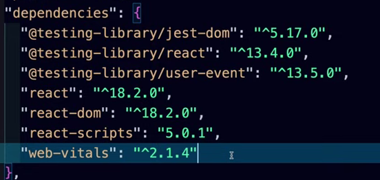

# Lecture: 01
- Installation & Basic Knowledge about React
---

# Leture: 02
- **Vite** is bundler, which takes most of our code and compile it into a bundle (will be discussed later on)
- React Library have many attachments for different purposes:
core library is react, then we have **React-DOM** for Web-based work, **React-native** for applications and so on..

## Creating a React App
- we use npx to initiate an app
```bash
npx create-react-app 01_basic_react
```
the above method is slow & time taking, see below

- after creation, we check **package.json** for dependencies & versions:

    - this includes: testing libraries, scripts & vitals libs for performance
    - **scripts** have diff options for start, dev & build

- we start our project, by first changing our directory to **package.json** folder.
```bas
npm run start
```
use above command to start your react app.

## Vite React App Creation:
- Vite only give us the minimum required stuff
- use following command to create vite latest project
```bash
npm create vite@latest
```
it will prompt you to enter details & select layout
- then we need to install the node modules
```bash
 cd [projec_name]
 npm install
```
- then to run it:
```bash
npm run dev
```
## Deleting Unecessary Files:
- Delete the following files with in basicReact creation:
    - setupUp_Tests.js
    - logo.svg
    - ReportwebVitals.js
    - App.css
    - index.css
    - App.test.js
    - remove dead-code from app.js & index.js

- Then make some changes (like h1 tag for *Hello world*) & run your app

- Same goes for ViteReact creation, keep only App.jxs & main.jxs in src folder for simplicity (for now)
---
